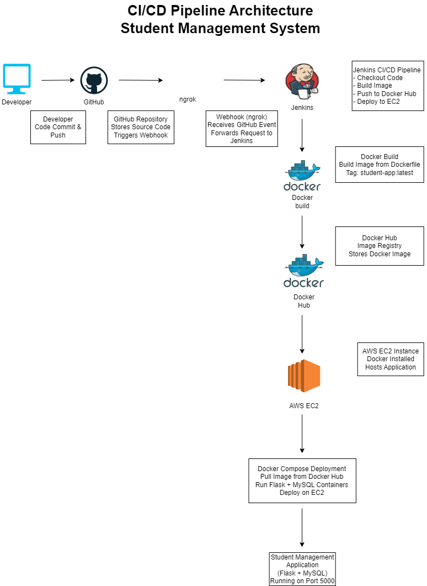
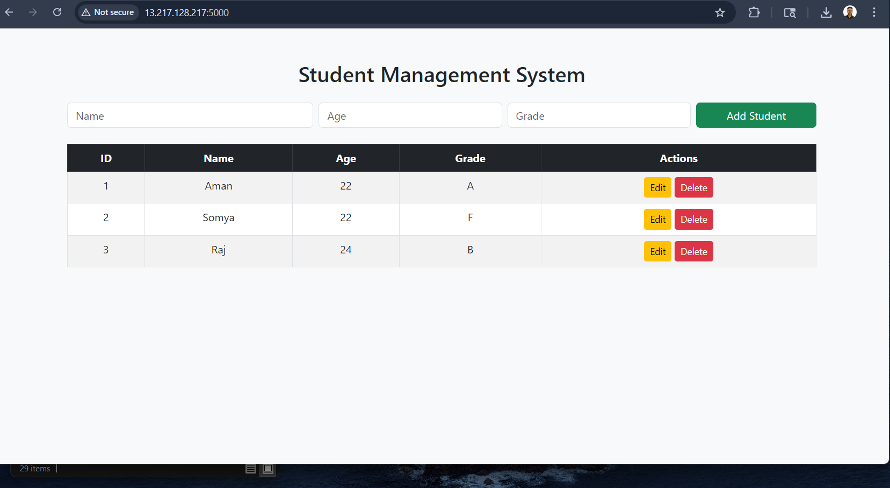
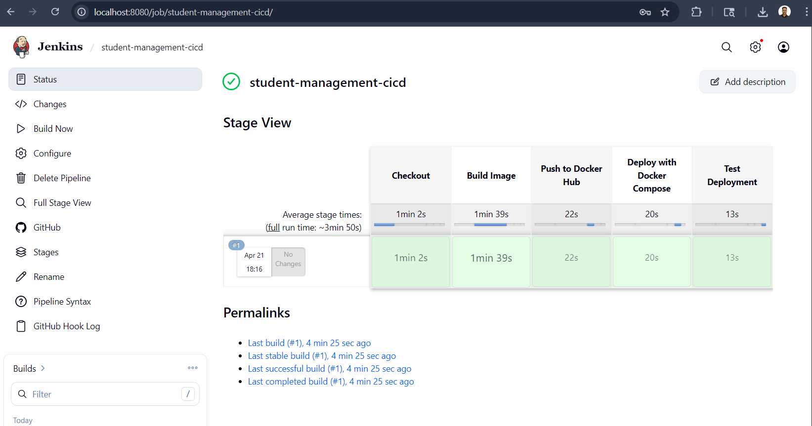

# 🎓 Student Management System

A full-stack web application to manage student records, built using Flask and MySQL, and deployed with a complete CI/CD pipeline using Docker, Jenkins, and AWS.

---

## 🚀 Features

* Add new student records
* View all students
* Update student details
* Delete student records

---

## 🛠 Tech Stack

**Frontend:** HTML, CSS
**Backend:** Flask (Python)
**Database:** MySQL

**DevOps Tools:**

* Docker (Containerization)
* Jenkins (CI/CD Automation)
* GitHub (Version Control)
* AWS EC2 (Cloud Deployment)
* ngrok (Webhook tunneling)

---

## 🔄 CI/CD Pipeline Overview

This project follows an automated CI/CD workflow:

1. Developer pushes code to GitHub
2. GitHub triggers webhook
3. ngrok forwards request to Jenkins
4. Jenkins pipeline executes:

   * Checkout code
   * Build Docker image
   * Push image to Docker Hub
   * Deploy to AWS EC2
5. EC2 pulls image and runs containers using Docker Compose

---

## 🏗 Architecture Diagram



---

## 🐳 Running with Docker

```bash
docker build -t student-app .
docker run -d -p 5000:5000 student-app
```

---

## ☁️ Deployment (AWS EC2)

* EC2 instance configured with Docker
* Application deployed using Docker Compose
* Flask + MySQL containers run on EC2

## 📸 Application Preview

User interface of the Student Management System running inside a Docker container.



---

## ⚙️ Jenkins Pipeline

Pipeline stages:

* Checkout code from GitHub
* Build Docker image
* Push image to Docker Hub
* Deploy application on EC2

## ⚙️ Jenkins Pipeline Execution

CI/CD pipeline showing build, push, and deployment stages executed successfully.



---

## 💻 Local Setup (Without Docker)

```bash
git clone https://github.com/your-username/student-management-system.git
cd student-management-system

python -m venv venv
venv\Scripts\activate   # Windows

pip install -r requirements.txt
python app/app.py
```

---

## 📌 Future Improvements

* ## 📌 Future Improvements
- Infrastructure provisioning using Terraform  
- Observability with Prometheus and Grafana  
- Image versioning and rollback strategy  

---

## 👨‍💻 Author

**Aman Kumar Rai**
